# Zygo Platform Database Schema

## Complete Firebase Collections Schema

```mermaid
erDiagram
    %% ==========================================
    %% CORE ACTOR SYSTEM
    %% ==========================================
    
    actors {
        string id PK "Unique actor identifier"
        string type "educator|service_provider|community_member"
        string email UK "Unique email address"
        timestamp created_at "Account creation time"
        timestamp updated_at "Last update time"
        json metadata "Flexible metadata storage"
        boolean is_active "Account status"
        string verification_status "verified|pending|unverified"
    }

    %% ==========================================
    %% SPECIALIZED ACTOR COLLECTIONS
    %% ==========================================

    educators {
        string id PK "Educator unique ID"
        string actor_id FK "Reference to actors"
        string first_name "Given name"
        string last_name "Family name"
        string title "Professional title"
        string bio "Professional biography"
        json specializations "Areas of expertise"
        json credentials "Professional credentials"
        string center_id FK "Reference to service_centers"
        json contact_info "Contact details"
        number years_experience "Years of experience"
        json availability "Scheduling availability"
        json pricing "Fee structure"
    }

    service_providers {
        string id PK "Provider unique ID"
        string actor_id FK "Reference to actors"
        string first_name "Given name"
        string last_name "Family name"
        string title "Professional title"
        string bio "Professional biography"
        string personal_story "Personal background"
        json specializations "Service specializations"
        json credentials "Professional credentials"
        string center_id FK "Reference to service_centers"
        json services "Services offered"
        json languages "Spoken languages"
        number years_experience "Years of experience"
        string approach "Care philosophy"
        json availability "When available"
        json pricing "Pricing structure"
        string profile_image "Profile photo URL"
        string header_background_image "Header image URL"
    }

    community_members {
        string id PK "Member unique ID"
        string actor_id FK "Reference to actors"
        string handle UK "Unique username"
        string first_name "Given name"
        string last_name "Family name"
        string display_name "Public display name"
        string profile_image "Profile photo URL"
        string date_of_birth "Birth date ISO format"
        string role "parent|child|grandparent|guardian|caregiver"
        string age_group "infant|toddler|preschool|child|adolescent|adult|senior"
        string tagline "Brief bio"
        string bio "Longer description"
        json location "Address/location info"
        json family_relationships "Family connections"
        json followed_providers "Followed service providers"
        boolean is_active "Account status"
        timestamp joined_date "Join date"
        timestamp last_active_date "Last activity"
        string privacy_level "public|family|private"
        boolean has_limited_profile "For children"
        json parental_controls "Privacy controls"
        json interests "User interests"
        json preferred_languages "Language preferences"
        json accessibility "Accessibility preferences"
        json credentials "Relevant credentials"
    }

    service_centers {
        string id PK "Center unique ID"
        string name "Center name"
        string description "Center description"
        string overview "Detailed overview"
        string mission "Mission statement"
        json location "Address and coordinates"
        json contact_info "Phone, email, website"
        json operating_hours "Hours by day of week"
        json features "Center features"
        json certifications "Center certifications"
        json insurance "Accepted insurance"
        json accessibility "Accessibility features"
        json images "Center photos"
        number established_year "Year established"
        string cultural_considerations "Cultural notes"
    }

    %% ==========================================
    %% FEED AND SOCIAL SYSTEM
    %% ==========================================

    feed_items {
        string id PK "Feed item unique ID"
        string type "post|link|milestone|breastfeeding_daily|breastfeeding_weekly|sponsored|event|tool_cta|library_reminder"
        string author_id FK "Reference to actor"
        string author_type "actor|system"
        string title "Post title"
        string description "Post description"
        string content "Main post content/HTML"
        string image_url "Attached image"
        string url "External link"
        string domain "Link domain"
        timestamp created_at "Creation time"
        timestamp updated_at "Last update time"
        string source "Content source"
        string source_url "Original URL"
        json stats "likes, shares, comments counts"
        json privacy_settings "Visibility and sharing rules"
        json type_specific_data "Data specific to feed item type"
        boolean has_references "Has reference links"
        json peer_likes "Likes from verified providers"
    }

    comments {
        string id PK "Comment unique ID"
        string feed_item_id FK "Reference to feed item"
        string author_id FK "Reference to actor"
        string author_type "Actor type"
        string content "Comment text"
        string parent_comment_id FK "For threaded comments"
        timestamp created_at "Creation time"
        timestamp updated_at "Last update time"
        boolean is_deleted "Deletion status"
        json reactions "Reaction counts"
    }

    likes {
        string id PK "Like unique ID"
        string target_id FK "feed_item_id or comment_id"
        string target_type "feed_item|comment"
        string user_id FK "Reference to actor"
        string user_type "Actor type"
        timestamp created_at "Creation time"
    }

    %% ==========================================
    %% CREDENTIALS MANAGEMENT SYSTEM
    %% ==========================================

    credential_providers {
        string id PK "Provider unique ID"
        string name "Provider name"
        string abbreviation "Short name"
        string description "Provider description"
        string type "university|professional_body|government|training_org|certification_body"
        string country "Country code"
        string website "Official website"
        json contact_info "Contact details"
        json verification_methods "How to verify credentials"
        boolean is_active "Provider status"
        number established_year "Year established"
        json credentials_issued "Types of credentials issued"
    }

    credential_definitions {
        string id PK "Definition unique ID"
        string provider_id FK "Reference to credential_providers"
        string title "Credential title"
        string abbreviation "Credential abbreviation"
        string description "Credential description"
        string type "degree|certification|license|registration|fellowship|membership|training|award|qualification"
        string category "medical|nursing|allied_health|education|fitness|childcare|mental_health|nutrition|technology|business|safety|regulatory"
        json requirements "Credential requirements"
        number duration_months "Completion time"
        boolean requires_renewal "Renewal required"
        number renewal_period_months "Renewal period"
        json prerequisites "Required prior credentials"
        boolean is_active "Definition status"
        timestamp created_at "Creation time"
        timestamp updated_at "Last update time"
    }

    personal_credentials {
        string id PK "Credential unique ID"
        string owner_id FK "Reference to actor"
        string owner_type "educator|service_provider|community_member"
        string credential_definition_id FK "Reference to credential_definitions"
        string provider_id FK "Reference to credential_providers"
        string verification_status "verified|pending|expired|invalid|self_reported"
        string issue_date "Issue date ISO format"
        string expiry_date "Expiry date ISO format"
        string credential_number "Official credential number"
        json verification_documents "Supporting documents"
        timestamp created_at "Creation time"
        timestamp updated_at "Last update time"
        json verification_history "Verification attempt history"
    }

    %% ==========================================
    %% PEDAGOGY AND MILESTONE SYSTEM
    %% ==========================================

    pedagogy_profiles {
        string id PK "Profile unique ID"
        string family_id UK "Unique family identifier"
        string name "Profile name"
        string description "Profile description"
        string based_on_template "Template reference"
        json customizations "Family-specific customizations"
        timestamp created_date "Creation time"
        timestamp modified_date "Last modification time"
    }

    family_members {
        string id PK "Member unique ID"
        string pedagogy_profile_id FK "Reference to pedagogy_profiles"
        string name "Member name"
        string relationship "parent|child|grandparent|guardian|caregiver"
        string date_of_birth "Birth date ISO format"
        string profile_image "Profile photo URL"
        boolean is_active "Current vs historical"
        timestamp joined_date "Join date"
        timestamp left_date "Leave date if inactive"
    }

    milestones {
        string id PK "Milestone unique ID"
        string title "Milestone title"
        string description "Milestone description"
        string category "physical|cognitive|social_emotional|language|motor_skills|sensory|self_care|academic|creative|play_based|recreational"
        string age_range_key "Age range identifier"
        string age_range "Human readable age range"
        number start_months "Start age in months"
        number end_months "End age in months"
        string period "prenatal|infancy|early_childhood|preschool|school_age|adolescence"
        string importance "low|medium|high|critical"
        boolean is_typical "Typical vs adaptive milestone"
        json prerequisites "Prerequisite milestone IDs"
        json skills "Related skills"
        string observation_tips "How to observe progress"
        string support_strategies "How to support development"
        string red_flags "Warning signs"
        string resources "Helpful resources"
        timestamp created_date "Creation time"
        timestamp modified_date "Last modification time"
    }

    milestone_progress {
        string id PK "Progress unique ID"
        string pedagogy_profile_id FK "Reference to pedagogy_profiles"
        string family_member_id FK "Reference to family_members"
        string milestone_id FK "Reference to milestones"
        string status "not_started|in_progress|completed|deferred|not_applicable"
        timestamp date_started "Start date"
        timestamp date_completed "Completion date"
        string notes "Progress notes"
        json evidence "Evidence records"
        string custom_adaptations "Family-specific adaptations"
    }

    milestone_evidence {
        string id PK "Evidence unique ID"
        string milestone_progress_id FK "Reference to milestone_progress"
        string type "photo|video|audio|text|document"
        string url "File URL"
        string description "Evidence description"
        timestamp date_recorded "Recording date"
        string recorded_by FK "Reference to family_members"
    }

    %% ==========================================
    %% TOOLS AND TRACKING DATA
    %% ==========================================

    breastfeeding_sessions {
        string id PK "Session unique ID"
        string family_member_id FK "Reference to family_members"
        timestamp start_time "Session start time"
        timestamp end_time "Session end time"
        number duration_minutes "Session duration"
        number happiness_level "1-10 scale"
        number soreness_level "1-10 scale"
        string notes "Session notes"
        string session_type "regular|cluster|night"
        json metadata "Additional session data"
    }

    growth_measurements {
        string id PK "Measurement unique ID"
        string family_member_id FK "Reference to family_members"
        timestamp measured_date "Measurement date"
        number weight_kg "Weight in kilograms"
        number height_cm "Height in centimeters"
        number head_circumference_cm "Head circumference"
        string measurement_type "routine|doctor_visit|home"
        string notes "Measurement notes"
        string measured_by "Who took the measurement"
    }

    sleep_sessions {
        string id PK "Session unique ID"
        string family_member_id FK "Reference to family_members"
        timestamp sleep_start "Sleep start time"
        timestamp sleep_end "Sleep end time"
        number duration_minutes "Sleep duration"
        string sleep_type "nap|night|overnight"
        number quality_rating "1-10 scale"
        string notes "Sleep notes"
        json wake_ups "Wake up events during sleep"
    }

    %% ==========================================
    %% RELATIONSHIP AND ASSOCIATION TABLES
    %% ==========================================

    actor_relationships {
        string id PK "Relationship unique ID"
        string actor_id_1 FK "First actor reference"
        string actor_id_2 FK "Second actor reference"
        string relationship_type "follows|family|colleague|friend"
        json metadata "Relationship metadata"
        timestamp created_at "Creation time"
        boolean is_active "Relationship status"
    }

    center_providers {
        string id PK "Association unique ID"
        string center_id FK "Reference to service_centers"
        string provider_id FK "Reference to service_providers"
        string role "educator|specialist|director|admin"
        timestamp start_date "Employment start"
        timestamp end_date "Employment end"
        boolean is_active "Employment status"
    }

    %% ==========================================
    %% RELATIONSHIPS BETWEEN COLLECTIONS
    %% ==========================================

    %% Core Actor Relationships
    actors ||--|| educators : "specializes as"
    actors ||--|| service_providers : "specializes as"
    actors ||--|| community_members : "specializes as"
    
    %% Service Center Relationships
    educators }|--|| service_centers : "works at"
    service_providers }|--|| service_centers : "works at"
    service_centers ||--o{ center_providers : "employs"
    center_providers }|--|| service_providers : "associates"
    
    %% Feed System Relationships
    actors ||--o{ feed_items : "creates"
    feed_items ||--o{ comments : "has"
    feed_items ||--o{ likes : "receives"
    comments ||--o{ likes : "receives"
    comments }|--|| comments : "replies to"
    actors ||--o{ comments : "writes"
    actors ||--o{ likes : "gives"
    
    %% Credentials System Relationships
    credential_providers ||--o{ credential_definitions : "issues"
    credential_definitions ||--o{ personal_credentials : "instantiated as"
    actors ||--o{ personal_credentials : "owns"
    credential_providers ||--o{ personal_credentials : "issued by"
    
    %% Pedagogy System Relationships
    community_members ||--o{ pedagogy_profiles : "belongs to"
    pedagogy_profiles ||--o{ family_members : "includes"
    family_members ||--o{ milestone_progress : "tracks"
    milestones ||--o{ milestone_progress : "measured by"
    milestone_progress ||--o{ milestone_evidence : "documented with"
    family_members ||--o{ milestone_evidence : "records"
    
    %% Tools Data Relationships
    family_members ||--o{ breastfeeding_sessions : "records"
    family_members ||--o{ growth_measurements : "has"
    family_members ||--o{ sleep_sessions : "logs"
    
    %% Social Relationships
    actors ||--o{ actor_relationships : "participates in"
```



## Key Schema Design Features

### 🎯 **Polymorphic Actor System**
- Single `actors` collection as the base for all users
- Specialized collections for different actor types
- Unified authentication and permissions
- Easy to add new actor types without schema changes

### 📱 **Flexible Feed System**
- Single `feed_items` collection for all content types
- `type_specific_data` field for polymorphic content
- Optimized for social media read patterns
- Support for comments, likes, and peer reactions

### 🎓 **Comprehensive Credentials Management**
- Provider registry for credential issuing organizations
- Standardized credential definitions
- Individual credential instances with verification
- Support for multiple verification methods

### 📚 **Family-Centric Pedagogy System**
- Pedagogy profiles scoped to families
- Milestone tracking with evidence collection
- Flexible progress states and custom adaptations
- Support for multiple family members

### 🛠️ **Tool-Specific Data Collections**
- Optimized for time-series health/development data
- Separate collections for different tracking tools
- Efficient querying and aggregation patterns
- Flexible metadata storage

### 🔗 **Relationship Management**
- Generic relationship system between actors
- Provider-center associations
- Family relationship tracking
- Social following and connections

## Performance Optimizations

### 📊 **Required Composite Indexes**
```javascript
// actors collection
["type", "is_active", "created_at"]
["verification_status", "type"]

// feed_items collection  
["author_id", "created_at"]
["type", "privacy_settings.visibility", "created_at"]

// milestone_progress collection
["family_member_id", "status", "date_completed"]
["pedagogy_profile_id", "milestone_id"]

// personal_credentials collection
["owner_id", "verification_status", "expiry_date"]
["credential_definition_id", "verification_status"]
```

### 🚀 **Query Patterns**
- **Actor feeds**: Query by `author_id` and `created_at`
- **Family milestones**: Query by `pedagogy_profile_id` and filter by `family_member_id`
- **Credential verification**: Query by `owner_id` and `verification_status`
- **Tool data aggregation**: Query by `family_member_id` and date ranges

### 💾 **Data Denormalization**
- Feed items include denormalized author info for display
- Milestone progress includes family member references
- Comments include author type for efficient rendering
- Stats are denormalized in feed items for performance

This schema provides a solid foundation for the Zygo platform with excellent scalability, performance, and flexibility for future feature additions.
